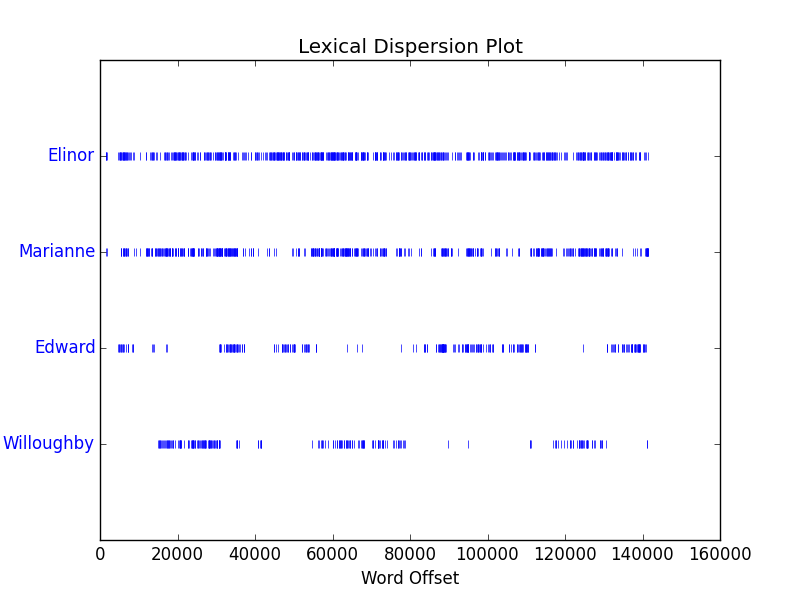

**(1)**	

	text2.dispersion_plot(['Elinor','Marianne','Edward','Willoughby'])

从分布可以看出Elinor为第一女主角，在全文中出现频率极高，另一女主角Marianne出现频率稍微少于Elinor但是也很多。两位男主角出现频率较少且同时出现的次数较少。可以猜测小说应该是以两位女主角为主线。	

**(2)**
	
	sorted([w for w in set(text5) if len(w)>1 and w[0]=='t'])
	[u't he', u"t'anks", u't-shirt', u't/c', u't/y', u'ta', u'tab', u'tabasco', u'tabbed', u'table', u'tackles', u'tacoma', u'tad', u'tah', u'tail', u'take', u'taken', u'takers', u'takes', u'taking', u'talented', u'talk', u'talkcity', u'talked', u'talkiing', u'talkin', u"talkin'", u'talking', u'talks', u'tall', u'tape', u'tapes', u'tapping', u'tart', u'taste', u'tastes', u'tatatatnanaantatat', u'tazzmaniane', u'tc', u'td', u'tdr', u'teach', u'teacher', u'teachers', u'team', u'tears', u'teasing', u'technical', u'technique', u'techniques', u'technologically', u'teck', u'teehee', u'teenagers', u'teens', u'teeth', u'teh', u'tell', u'tellin', u'telling', u'telllin', u'temp', u'temples', u'temptations', u'tend', u'tenn', u'tennesee', u'tennessee', u'tennies', u'teo', u'tere', u'term', u'terrible', u'test', u'texan', u'texas', u'tha', u'thah', u'than', u'thang', u'thank', u'thanks', u'thanksgiving', u'thanksss', u'thanx', u'that', u'thats', u'the', u'theere', u'theft', u'their', u'them', u'themself', u'themselves', u'themselvs', u'then', u'theory', u'ther', u'therapist', u'therapy', u'there', u'theres', u'these', u'they', u'thing', u'things', u'thingy', u'think', u'thinkin', u'thinking', u'thinks', u'third', u'thirsty', u'this', u'thje', u'thnx', u'tho', u'thomas', u'those', u'thot', u'though', u'thought', u'thoughts', u'thows', u'three', u'threw', u'thrill', u'thristy', u'through', u'throught', u'throw', u'thrown', u'throws', u'thru', u'thumb', u'thunder', u'thx', u'tick', u'ticket', u'tickets', u'tiff', u'tightly', u'tighty', u'til', u'till', u'time', u'times', u'timing', u'tingly', u'tips', u'tired', u'tisk', u'title', u'tits', u'tjhe', u'tks', u'tlak', u'to', u'tock', u'today', u'toe', u'toenails', u'toes', u'together', u'tok', u'toke', u'told', u'toledo', u'tom', u'tommorrow', u'tomorrow', u'tonawanda', u'tongue', u'tonight', u'tonite', u'too', u'took', u'tooo', u'tooooooooooo', u'toop', u'tootsie', u'top', u'topic', u'topics', u'topless', u'torah', u'torturing', u'tory', u'toss', u'tosses', u'total', u'totally', u'totaly', u'touch', u'touches', u'touchy', u'tough', u'tounge', u'toward', u'towel', u'towels', u'town', u'toy', u'tracey', u'track', u'tradition', u'traffic', u'trailer', u'trance', u'trapped', u'trash', u'trashed', u'trials', u'tried', u'tries', u'trigger', u'trip', u'trippin', u'trippy', u'troll', u'trolls', u'trouble', u'trout', u'truck', u'true', u'truss', u'trust', u'try', u'tryer', u'tryin', u'tryina', u'trying', u'tthe', u'tu', u'tuesday', u'tug', u'tummy', u'tune', u'tuned', u'turkey', u'turkish', u'turn', u'turned', u'turning', u'turns', u'tv', u'twice', u'twin', u'twisted', u'twister', u'twit', u'twizted', u'two', u'twoel', u'tx', u'ty', u'type', u'typed', u'typin', u'typing', u'typo', u'tyvm']
	l5=[w for w in set(text5) if len(w)==5]#生成长度为5的单词构成的列表
	fdist1=FreqDist(text5)#生成频率字典
	l5.sort(key=lambda x:fdist1[x],reverse=True)#按频率排序
	
(3)

	[w for w in set(text2) if len(w)>1 and w[-2::]=='er']#以er结尾
	[w for w in set(text2) if w.find('m')!=-1]#包含m
	[w for w in set(text2) if w.find('ph')!=-1]#包含字母序列ph
	def titleCase(w):#判断单词是是否满足titleCase符合时返回1否则返回0
    	def lowCase(w):
        	if w<='z' and w>='a':
            	return 1
        	else:
            	return 0
    	if len(w)==0 or lowCase(w[0])==1:
        	return 0
    	for x in range(1,len(w)):
        	if lowCase(w[x])==0:
            	return 0
    	return 1
    [w for w in set(text2) if titleCase(w)==1]#输出符合titleCase的单词

	
	